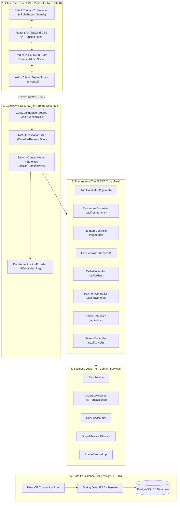
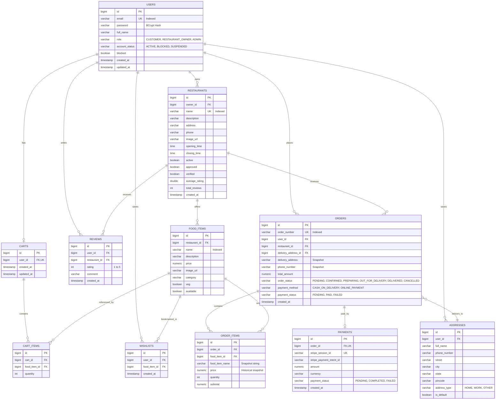

# 🍽️ Feastify — Master System Architecture, Database Design & Technical Interview Guide

> **Production-Grade Full-Stack Food Delivery Platform**  
> **Tech Stack:** Java 21 LTS | Spring Boot 3.4.5 | PostgreSQL 16 (Neon Cloud / Docker) | React 19 | Redux Toolkit | Vite 8 | Tailwind CSS v4 | Stripe Payments | JJWT | Docker

---

## 📑 Table of Contents
1. [System Architecture Diagram](#1-system-architecture-diagram)
2. [Visual Database ER Diagram & Relational Schema](#2-visual-database-er-diagram--relational-schema)
3. [REST API Design Specification](#3-rest-api-design-specification)
4. [Security & Authentication Flow](#4-security--authentication-flow)
5. [Order Lifecycle & Payment State Machine](#5-order-lifecycle--payment-state-machine)
6. [System Design & Backend Interview Questions (15+ Q&As)](#6-system-design--backend-interview-questions)

---

## 🏛️ 1. System Architecture Diagram

### 1.1 Visual Layer Map
```
┌─────────────────────────────────────────────────────────────────────────────────────────┐
│                                CLIENT TIER (React 19 SPA)                               │
│  [ React Router v7 ]  ───►  [ Redux Toolkit Slices ]  ───►  [ Axios JWT Interceptors ]  │
│  (Role & Auth Guards)       (Auth, Cart, Orders, Admin)     (Bearer Token & Errors)     │
└───────────────────────────────────────────┬─────────────────────────────────────────────┘
                                            │ HTTPS (JSON Payloads / REST)
                                            ▼
┌─────────────────────────────────────────────────────────────────────────────────────────┐
│                        GATEWAY & SECURITY TIER (Spring Security 6)                      │
│   CorsConfigurationSource ──► JwtAuthenticationFilter ──► SecurityContextHolder        │
│   (Origin Whitelist)          (OncePerRequestFilter)      (Stateless Authentication)    │
└───────────────────────────────────────────┬─────────────────────────────────────────────┘
                                            │ Authorized Principal
                                            ▼
┌─────────────────────────────────────────────────────────────────────────────────────────┐
│                         PRESENTATION TIER (REST Controllers)                           │
│  AuthController   • RestaurantController • FoodItemController • CartController          │
│  OrderController  • PaymentController    • AdminController    • SearchController        │
└───────────────────────────────────────────┬─────────────────────────────────────────────┘
                                            │ DTOs / Service Invocation
                                            ▼
┌─────────────────────────────────────────────────────────────────────────────────────────┐
│                         BUSINESS LOGIC TIER (Domain Services)                           │
│  AuthService      • OrderServiceImpl (@Transactional) • CartServiceImpl                 │
│  SearchService    • AdminServiceImpl (KPIs)           • StripeCheckoutService           │
└──────────────────────┬────────────────────────────────────────────┬─────────────────────┘
                       │                                            │
                       ▼                                            ▼
┌──────────────────────────────────────────────┐ ┌────────────────────────────────────────┐
│     PERSISTENCE TIER (Spring Data JPA)       │ │            EXTERNAL SERVICES           │
│  • HikariCP Connection Pool (Max: 10)        │ │  • Stripe Payments API                 │
│  • Hibernate ORM (Lazy Loading + JPQL Joins) │ │  • Stripe Webhook Signature Check      │
│  • PostgreSQL 16 (Neon Cloud / Docker DB)    │ │                                        │
└──────────────────────────────────────────────┘ └────────────────────────────────────────┘
```

### 1.2 Mermaid Architecture Diagram


---

## 🗄️ 2. Visual Database ER Diagram & Relational Schema

### 2.1 Visual ASCII Entity Relationship Schema
```
                                 ┌──────────────────────────────┐
                                 │            USERS             │
                                 ├──────────────────────────────┤
                                 │ PK  id           BIGINT      │
                                 │ UK  email        VARCHAR(255)│
                                 │     password     VARCHAR(255)│
                                 │     full_name    VARCHAR(255)│
                                 │     role         VARCHAR(50) │
                                 │     created_at   TIMESTAMP   │
                                 └──────────────┬───────────────┘
                                                │
         ┌──────────────────────────────────────┼──────────────────────────────────────┐
         │ 1                                    │ 1                                    │ 1
         │                                      │                                      │
         ▼ N                                    ▼ 1                                    ▼ N
┌──────────────────────────────┐       ┌──────────────────────────────┐       ┌──────────────────────────────┐
│         RESTAURANTS          │       │            CARTS             │       │          ADDRESSES           │
├──────────────────────────────┤       ├──────────────────────────────┤       ├──────────────────────────────┤
│ PK  id           BIGINT      │       │ PK  id           BIGINT      │       │ PK  id           BIGINT      │
│ FK  owner_id     BIGINT      │◄───┐  │ FK  user_id      BIGINT(UK)  │       │ FK  user_id      BIGINT      │
│ UK  name         VARCHAR(255)│    │  │     created_at   TIMESTAMP   │       │     street       VARCHAR(255)│
│     address      VARCHAR(255)│    │  └──────────────┬───────────────┘       │     city         VARCHAR(100)│
│     rating       DOUBLE      │    │                 │ 1                     │     pincode      VARCHAR(20) │
│     active       BOOLEAN     │    │                 │                       │     is_default   BOOLEAN     │
└──────────────┬───────────────┘    │                 ▼ N                     └──────────────┬───────────────┘
               │ 1                  │  ┌──────────────────────────────┐                      │ 1
               │                    │  │          CART_ITEMS          │                      │
               ▼ N                  │  ├──────────────────────────────┤                      │
┌──────────────────────────────┐    │  │ PK  id           BIGINT      │                      │
│          FOOD_ITEMS          │    │  │ FK  cart_id      BIGINT      │                      │
├──────────────────────────────┤    │  │ FK  food_item_id BIGINT      │                      │
│ PK  id           BIGINT      │    │  │     quantity     INT         │                      │
│ FK  restaurant_id BIGINT     │    │  └──────────────────────────────┘                      │
│     name         VARCHAR(255)│    │                                                        │
│     price        NUMERIC     │────┤                                                        │
│     category     VARCHAR(100)│    │                                                        │
│     available    BOOLEAN     │    │                                                        │
└──────────────┬───────────────┘    │                                                        │
               │ 1                  │                                                        │
               │                    │                                                        │
               ▼ N                  │ N                                                      ▼ N
┌──────────────────────────────┐    │  ┌─────────────────────────────────────────────────────────────┐
│         ORDER_ITEMS          │    │  │                           ORDERS                            │
├──────────────────────────────┤    │  ├─────────────────────────────────────────────────────────────┤
│ PK  id           BIGINT      │    │  │ PK  id                   BIGINT                             │
│ FK  order_id     BIGINT      │    └──│ FK  restaurant_id        BIGINT                             │
│ FK  food_item_id BIGINT      │       │ FK  user_id              BIGINT                             │
│     food_item_name VARCHAR   │◄──────│ FK  delivery_address_id  BIGINT                             │
│     price (Snapshot) NUMERIC │       │ UK  order_number         VARCHAR(100)                       │
│     quantity     INT         │       │     total_amount         NUMERIC                            │
│     subtotal     NUMERIC     │       │     order_status         VARCHAR(50) [PENDING, CONFIRMED...]│
└──────────────────────────────┘       │     payment_status       VARCHAR(50) [PENDING, PAID, FAILED]│
                                       └──────────────────────────────┬──────────────────────────────┘
                                                                      │ 1
                                                                      │
                                                                      ▼ 1
                                       ┌─────────────────────────────────────────────────────────────┐
                                       │                          PAYMENTS                           │
                                       ├─────────────────────────────────────────────────────────────┤
                                       │ PK  id                       BIGINT                         │
                                       │ FK  order_id                 BIGINT (UK)                    │
                                       │ UK  stripe_session_id        VARCHAR(255)                   │
                                       │     stripe_payment_intent_id VARCHAR(255)                   │
                                       │     amount                   NUMERIC                        │
                                       │     payment_status           VARCHAR(50) [COMPLETED, FAILED]│
                                       └─────────────────────────────────────────────────────────────┘
```

### 2.2 Mermaid ER Diagram


---

## 📡 3. REST API Design Specification

### 3.1 Authentication (`/api/auth`)
| HTTP Verb | Endpoint | Access Level | Request Body | Response | Description |
|---|---|---|---|---|---|
| `POST` | `/api/auth/register` | Public | `{email, password, fullName, role, phone}` | `AuthResponse (token, user)` | Registers Customer, Owner, or Admin |
| `POST` | `/api/auth/login` | Public | `{email, password}` | `AuthResponse (token, user)` | Authenticates credentials, returns signed JWT |

### 3.2 Restaurants (`/api/restaurants`)
| HTTP Verb | Endpoint | Access Level | Request Body / Params | Description |
|---|---|---|---|---|
| `GET` | `/api/restaurants` | Public | `page, size, sort` | List all verified and active restaurants |
| `GET` | `/api/restaurants/{id}` | Public | — | Get single restaurant details |
| `POST` | `/api/restaurants` | Owner | `RestaurantRequest` | Register new restaurant |
| `PUT` | `/api/restaurants/{id}` | Owner | `RestaurantRequest` | Update owned restaurant profile |
| `DELETE` | `/api/restaurants/{id}` | Admin | — | Remove restaurant from platform |

### 3.3 Menu & Food Items (`/api/foods`)
| HTTP Verb | Endpoint | Access Level | Request Body / Params | Description |
|---|---|---|---|---|
| `GET` | `/api/foods` | Public | — | Browse menu catalog |
| `GET` | `/api/foods/{id}` | Public | — | Get single food item details |
| `GET` | `/api/foods/restaurant/{restaurantId}` | Public | — | List all items for a restaurant |
| `POST` | `/api/foods` | Owner | `FoodItemRequest` | Add a food item to restaurant menu |
| `PUT` | `/api/foods/{id}` | Owner | `FoodItemRequest` | Update item price or availability |
| `DELETE` | `/api/foods/{id}` | Owner | — | Delete food item from menu |

### 3.4 Shopping Cart (`/api/cart`)
| HTTP Verb | Endpoint | Access Level | Request Body / Params | Description |
|---|---|---|---|---|
| `GET` | `/api/cart` | Customer | — | Fetch current user cart and line items |
| `POST` | `/api/cart/items` | Customer | `{foodItemId, quantity}` | Add item to cart |
| `PUT` | `/api/cart/items/{id}` | Customer | `{quantity}` | Update quantity of a cart item |
| `DELETE` | `/api/cart/items/{id}` | Customer | — | Remove item from cart |
| `DELETE` | `/api/cart` | Customer | — | Clear entire cart |

### 3.5 Orders (`/api/orders`)
| HTTP Verb | Endpoint | Access Level | Request Body / Params | Description |
|---|---|---|---|---|
| `POST` | `/api/orders` | Customer | `PlaceOrderRequest` | Place order atomically from cart |
| `GET` | `/api/orders` | Customer | — | Get customer's past order history |
| `GET` | `/api/orders/{id}` | Customer / Owner | — | Get order details with item breakdown |
| `GET` | `/api/orders/restaurant` | Owner | — | Fetch all incoming orders for owner's restaurant |
| `PUT` | `/api/orders/{id}/status` | Owner | `{status}` | Transition status (`CONFIRMED`, `PREPARING`, etc.) |
| `PUT` | `/api/orders/{id}/cancel` | Customer / Owner | — | Cancel active order |

### 3.6 Payments (`/api/payments`)
| HTTP Verb | Endpoint | Access Level | Request Body / Params | Description |
|---|---|---|---|---|
| `POST` | `/api/payments/checkout-session` | Customer | `{orderId}` | Generates a signed Stripe Checkout Session |
| `POST` | `/api/payments/verify` | Customer | `{orderId, sessionId}` | Synchronous payment verification fallback |
| `POST` | `/api/payments/webhook` | Public (Stripe) | Raw Event + `Stripe-Signature` | Asynchronous Stripe Webhook listener |

### 3.7 Search, Recommendations & Admin (`/api/search`, `/api/admin`)
| HTTP Verb | Endpoint | Access Level | Query Params / Body | Description |
|---|---|---|---|---|
| `GET` | `/api/search/restaurants` | Public | `keyword, minRating, page, size` | Paginated restaurant search |
| `GET` | `/api/search/foods` | Public | `keyword, category, veg, minPrice, maxPrice` | Multi-filter food item search |
| `GET` | `/api/recommendations/top-restaurants` | Public | `limit` | Top-rated restaurants |
| `GET` | `/api/recommendations/trending-foods` | Public | `limit` | Trending and popular dishes |
| `GET` | `/api/admin/stats` | Admin | — | 8 platform KPI metrics |
| `GET` | `/api/admin/analytics/revenue` | Admin | — | 30-day revenue analytics dataset |
| `GET` | `/api/admin/users` | Admin | — | List all users with account management |
| `PUT` | `/api/admin/users/{id}/status` | Admin | `{status}` | Block / Unblock / Suspend user |

---

## 🔐 4. Security & Authentication Flow

```
1. Login Request:
   Client ──────► POST /api/auth/login {email, password} ──────► Spring Security DaoAuthProvider
                                                                         │
                                                                         ▼ BCrypt Match
                                                                Generate JWT (HMAC-256)
   Client ◄────── HTTP 200 { token: "eyJhbGci...", user: {...} } ────────┘

2. Authenticated API Call:
   Client ──────► GET /api/orders (Header: "Authorization: Bearer eyJhbGci...")
                        │
                        ▼
   JwtAuthenticationFilter ──► Validates Signature & Expiration
                        │
                        ▼
   SecurityContextHolder   ──► Sets UsernamePasswordAuthenticationToken (User + Roles)
                        │
                        ▼
   OrderController         ──► Executes @Transactional Service & Returns Data
```

---

## 🔄 5. Order Lifecycle & Payment State Machine

```
   [ Customer Places Order ]
              │
              ▼
        ( PENDING ) ──────────────► ( CANCELLED ) [ Customer/Owner Cancels ]
              │
              ▼ [ Owner Clicks "Accept Order" ]
       ( CONFIRMED )
              │
              ▼ [ Kitchen Starts Cooking ]
       ( PREPARING )
              │
              ▼ [ Handed to Driver ]
   ( OUT_FOR_DELIVERY )
              │
              ▼ [ Driver Delivers Food ]
       ( DELIVERED ) ──► [ Order Complete ]
```

---

## 💡 6. System Design & Backend Interview Questions

### Q1: "Why did you choose a Modular Monolith architecture instead of Microservices?"
- **Answer:**
  > *"For this platform, a **Modular Monolith** provides the optimal balance: zero network serialization latency, zero distributed transaction overhead (no 2PC or Saga orchestrators), and low infrastructure complexity.
  > 
  > However, it is architected with **strict bounded contexts** (Auth, Catalog, Cart, Order, Payment, Analytics). If individual services like Payment Processing or Order Tracking require independent scaling, they can be extracted into standalone microservices communicating over Apache Kafka with minimal code refactoring."*

---

### Q2: "How do you ensure ACID transactional consistency during order placement?"
- **Answer:**
  > *"Order placement is wrapped in Spring's `@Transactional` annotation in `OrderServiceImpl`. The operation executes 5 atomic steps:
  > 1. Validates that the cart is not empty.
  > 2. Verifies that all cart items belong to a single restaurant.
  > 3. Creates the `Order` entity and creates **immutable historical snapshots** of food item names and prices in `OrderItem` records.
  > 4. Calculates the final billing summary and persists delivery address details.
  > 5. Clears the user's `Cart`.
  > 
  > If any step throws an unhandled `RuntimeException`, Spring rolls back the entire database transaction, preventing orphan records or inconsistent cart states."*

---

### Q3: "How does the Stripe Payment flow prevent client-side price tampering?"
- **Answer:**
  > *"We implement a **Zero-Trust Client** security model:
  > 1. The client never supplies monetary amounts to Stripe. The backend queries prices from the database, computes the subtotal, and creates a cryptographically signed Stripe Checkout Session.
  > 2. Rather than trusting the browser redirect query parameters, the backend relies on an asynchronous **Stripe Webhook** (`/api/payments/webhook`).
  > 3. The webhook verifies the `Stripe-Signature` header against Stripe's signing secret using HMAC-SHA256. Only upon signature verification is the `Payment` marked `COMPLETED` and the `Order` updated to `PAID`."*

---

### Q4: "How do you solve the N+1 Query Problem in Spring Data JPA?"
- **Answer:**
  > *"By default, all `@ManyToOne` and `@OneToMany` entity associations use `FetchType.LAZY` to avoid unnecessary eager joins.
  > 
  > When relational graphs must be loaded together (e.g. rendering an Order alongside its line items and restaurant details), we use **JPQL `JOIN FETCH` queries** or `@EntityGraph` annotations. This fetches all related entities in a single optimized SQL join query rather than triggering $N$ sequential round trips to PostgreSQL."*

---

### Q5: "How does the database handle concurrent cart additions for the same item?"
- **Answer:**
  > *"Each `CartItem` record is guarded by a composite unique constraint on `(cart_id, food_item_id)`.
  > 
  > When adding items, the service executes within a transaction: it checks if the composite pair exists. If found, it increments the existing quantity; otherwise, it inserts a new record. If two parallel requests fire simultaneously, PostgreSQL's unique constraint prevents duplicate rows, and the transaction layer handles conflict resolution idempotently."*

---

### Q6: "How would you design the system to scale to 100,000 concurrent active users?"
- **Answer:**
  > *"1. **Read/Write Database Splitting & Pooling:** Utilize Neon/PgBouncer connection pooling and direct read queries to Read Replicas while directing writes to the Primary database.
  > 2. **Distributed Redis Caching:** Cache frequently accessed, low-mutation catalog endpoints (`/api/restaurants`, `/api/foods`, `/api/recommendations`) using a Cache-Aside pattern with a 5-minute TTL.
  > 3. **Asynchronous Task Queues:** Offload email receipts, SMS alerts, and delivery driver dispatching to RabbitMQ or Apache Kafka message queues.
  > 4. **Stateless Horizontal Scaling:** Deploy stateless Spring Boot backend containers across AWS ECS / EKS behind an Application Load Balancer (ALB)."*

---

### Q7: "How would you implement real-time delivery driver tracking?"
- **Answer:**
  > *"1. **WebSocket / STOMP Broker:** Establish bi-directional WebSocket connections between the client (customer map view), driver mobile client, and backend.
  > 2. **Driver Location Ingestion:** The driver client emits GPS coordinates $(lat, lng)$ every 3–5 seconds to `/app/driver/location`.
  > 3. **Redis Geospatial (GEOADD / GEORADIUS):** Store real-time coordinates in Redis Geo keys with short TTLs for ultra-fast spatial querying.
  > 4. **Pub/Sub Fanout:** Redis Pub/Sub broadcasts driver coordinate updates to all WebSocket subscribers listening on `/topic/order/{orderId}`."*

---

### Q8: "How do you ensure API Idempotency for critical operations like Order Placement and Payments?"
- **Answer:**
  > *"1. **Idempotency Keys:** The client generates a unique UUID `Idempotency-Key` header with every checkout request.
  > 2. **Redis Atomic Lock / Store:** The backend checks Redis for `idempotency:{key}`. If absent, it sets the key with a `PROCESSING` status using `SETNX` (with a 60-second TTL).
  > 3. **Result Caching:** Once the order transaction commits, the response payload is cached against the key. If a duplicated network request arrives with the same key, the backend returns the cached response immediately without reprocessing."*

---

### Q9: "What database indexing strategy is applied in Feastify?"
- **Answer:**
  > *"Indexes are placed strategically on high-frequency filter and foreign key columns:
  > - **B-Tree Unique Indexes:** `users(email)`, `restaurants(name)`, `orders(order_number)`, `payments(stripe_session_id)`.
  > - **Foreign Key Indexes:** `orders(user_id)`, `orders(restaurant_id)`, `food_items(restaurant_id)`, `cart_items(cart_id)`.
  > - **Compound Indexes:** `(order_status, created_at)` on `orders` for fast owner dashboard filtering and date range analytics.
  > - **Full-Text / Partial Indexes:** `food_items(category, available)` for instant menu catalog filtering."*

---

### Q10: "If a restaurant changes a food item's price from \$10 to \$15, how do past orders retain the original \$10 price?"
- **Answer:**
  > *"This is solved through **Entity Snapshotting**. The `OrderItem` table does not solely link by foreign key to `food_items`; it contains explicit snapshot columns: `food_item_name` (varchar) and `price` (numeric).
  > 
  > When an order is placed, the exact price at that millisecond is copied into `OrderItem.price`. Any subsequent price modifications on the `FoodItem` table only affect future orders, preserving financial and tax audit integrity for past orders."*

---

## 🎯 Technical Interview Cheatsheet
- [x] **Architecture:** Modular Monolith with bounded contexts & stateless security.
- [x] **Database:** 18 relational tables, composite constraints, indexed foreign keys, snapshotting.
- [x] **Security:** BCrypt hashing, JWT filter chain, role-based authorization guards.
- [x] **Payment:** Zero-trust architecture with signed Stripe checkout and cryptographic webhook verification.
- [x] **Scalability Strategy:** Redis caching, connection pooling, Kafka async queues, read replicas.
